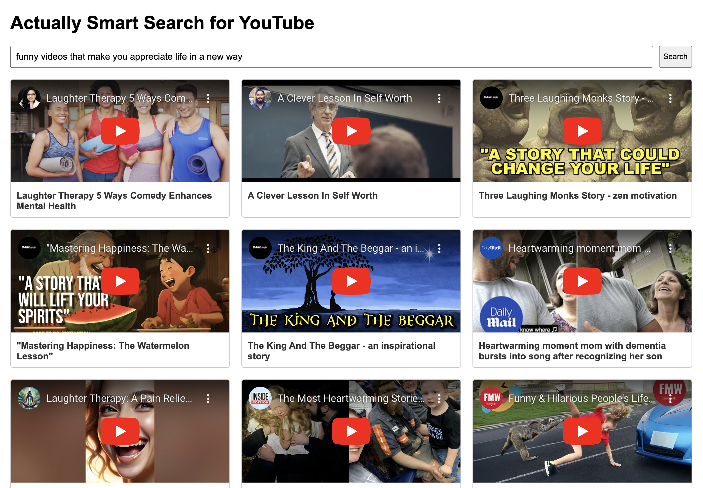

# Actually Smart Search for YouTube

Our mission is to provide a better search experience for YouTube users.
Imagine YouTube search that understands you. Not just keywords—your real questions, your intent, your curiosity. A search that doesn’t just find videos but finds answers. This is smart search, reimagined.

## Demo
> Solid YouTube video recommendations for an abstract query that understands the user's intent rather than just keywords.

## How to use:
- Clone the repository
- Add your own YouTube and OpenAI API keys
https://github.com/shivam15s/actually-smart-search/blob/d520b153eec30d19cd5836d932e219355d96cd2f/app.py#L11-L12
- Run `python app.py` and experience a smarter YouTube search
